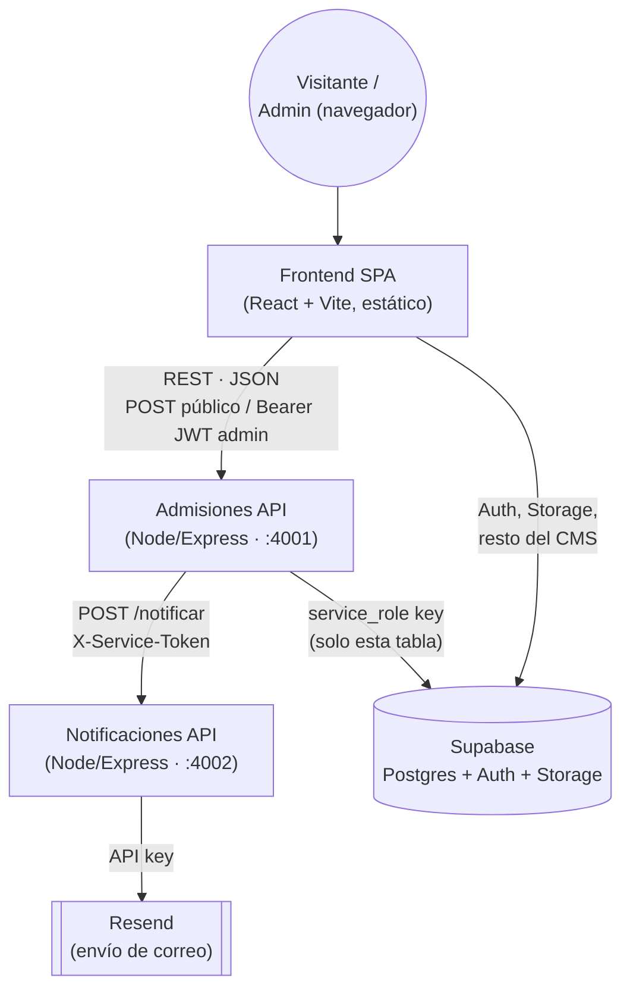

# Arquitectura orientada a servicios — Sitio FECA

Este documento es la guía para la exposición de "Aplicaciones Web
Orientadas a Servicios": qué servicios existen, cómo se comunican, por
qué se diseñaron así, y qué pasa cuando uno de ellos falla.

## 1. Diagrama

**Dirección real de la comunicación**: siempre de arriba hacia abajo en
el diagrama. Ningún servicio hace *callbacks* hacia quien lo llamó — el
Frontend nunca es llamado por Admisiones API, ni Admisiones API es
llamado por Notificaciones API. Eso es a propósito: comunicación
unidireccional y explícita, más fácil de razonar y de aislar cuando algo
falla.

## 2. Los servicios

| Servicio | Qué es | Quién lo llama | A quién llama |
|---|---|---|---|
| **Frontend SPA** | Sitio público + panel de administración (React, estático) | Visitantes | Admisiones API (dominio de solicitudes) y Supabase directo (todo lo demás: anuncios, login, egresados, etc.) |
| **Admisiones API** (`services/admisiones-api`) | Dueño exclusivo de `solicitudes_admision` | Frontend | Supabase (Postgres) y Notificaciones API |
| **Notificaciones API** (`services/notificaciones-api`) | Dueño exclusivo del envío de correos de aviso | Admisiones API | Resend (API externa de correo) |

Supabase **no es "uno de nuestros servicios"** para efectos de esta
rúbrica: es la infraestructura de base de datos administrada que ambos
microservicios propios usan como almacenamiento, igual que cualquier
empresa usa un clúster de Postgres compartido. Los dos servicios que sí
construyó el equipo — Admisiones API y Notificaciones API — no comparten
código ni proceso entre sí; solo se hablan por HTTP con un contrato
documentado (ver los `README.md` de cada carpeta en `services/`).

## 3. Quién administra el sitio y dónde se edita el contenido

**Quién entra.** El panel (`#/admin`) usa Supabase Auth: solo entra quien
tiene una cuenta creada ahí. Hoy esas cuentas se dan de alta a mano en
Supabase → Authentication → Users. Un maestro o directivo puede pedir
acceso desde la misma pantalla de login (`AdminLoginPage.jsx`), lo que
guarda una fila en `solicitudes_acceso_panel`; alguien con acceso la
revisa en la pestaña "Solicitudes de acceso" del panel, pero aprobarla
ahí **no crea la cuenta automáticamente** — sigue siendo un paso manual
en Supabase. No hay señal de que la aprobaron: quien las revisa avisa
por fuera (WhatsApp, correo) cuando ya la dio de alta.

**Dos lugares distintos para editar contenido, y por qué importa para la
rúbrica:**

1. **Panel propio del sitio** (`#/admin`, `src/pages/AdminPanelPage.jsx`)
   — pantallas hechas a medida para lo que cambia más seguido: Anuncios
   y noticias, Últimas noticias, Carrusel de Inicio, Documentos de
   egresados, Testimonios, Solicitudes de admisión, Opiniones del sitio,
   Solicitudes de acceso. De esas ocho, **solo "Solicitudes de admisión"
   pasa por un microservicio propio** (Admisiones API); las otras siete
   hablan directo con Supabase desde el navegador (`anon`/`authenticated`
   + RLS), igual que el resto del sitio público.
2. **Supabase Table Editor** (fuera del sitio, en supabase.com/dashboard)
   — para lo que todavía no tiene pantalla propia en el panel. Es edición
   manual directa sobre Postgres: no pasa por ningún servicio ni por el
   frontend, la usa directamente la persona que administra el sitio.

**Por qué se los mencionamos si van a preguntar "¿todo pasa por sus
servicios?"**: no. Solo el dominio de solicitudes de admisión tiene un
microservicio propio de por medio. El resto del contenido — incluida la
edición manual vía Table Editor — se apoya en Supabase directo,
protegido por políticas RLS en vez de por un contrato HTTP propio. Es
honesto decirlo así en la defensa: separar en microservicios el dominio
que de verdad lo necesitaba (solicitudes, con su flujo de notificación)
en vez de forzar los ocho dominios del panel a pasar por servicios
propios sin una razón real para cada uno.

## 4. Cómo se cumple cada criterio

**Autonomía del servicio.** Cada microservicio en `services/` tiene su
propio `package.json`, sus propias dependencias (`node_modules` no se
comparte) y su propio proceso (`npm start` en su carpeta). Se puede matar
uno con Ctrl+C y el otro sigue corriendo — no hay imports cruzados entre
`admisiones-api/src` y `notificaciones-api/src`, solo llamadas HTTP.

**Contrato de servicio bien definido.** Cada servicio documenta sus
endpoints, verbos, auth requerida y forma de request/response en su
`README.md`. Nada se infiere leyendo el código del otro servicio.

**Bajo acoplamiento.** Admisiones API no importa nada de
Notificaciones API ni conoce cómo manda el correo (Resend, plantillas,
etc.) — solo conoce el contrato `POST /notificar`. Si mañana
Notificaciones API cambia de Resend a otro proveedor, Admisiones API no
se entera ni se toca.

**Mecanismo de seguridad entre servicios.** Dos mecanismos distintos,
justificados según quién hace la llamada (ver detalle en
`services/admisiones-api/README.md`, sección "Seguridad"):

- Usuario → servicio: Bearer JWT de Supabase Auth, verificado localmente
  con `SUPABASE_JWT_SECRET` (no se re-consulta a Supabase en cada
  request).
- Servicio → servicio: secreto compartido `X-Service-Token`, comparado
  con `crypto.timingSafeEqual` (no expuesto al navegador, ni siquiera
  CORS habilitado en Notificaciones API para bloquear intentos desde un
  sitio web).

**Recursos y calidad de la exposición.** Este archivo + el diagrama de
arriba. Para la demo en vivo: levantar los 3 procesos (frontend + los
dos servicios), enviar una solicitud real desde `#/solicitud`, y
mostrarla apareciendo en `#/admin` → pestaña Solicitudes.

## 5. Guion sugerido para la demo en vivo

1. Levantar los tres procesos (ver `README.md` raíz y los de
   `services/*`).
2. Abrir `#/solicitud`, llenar el formulario, enviarlo. Mostrar en las
   herramientas de red del navegador la petición `POST` a
   `localhost:4001/api/solicitudes` y la respuesta `201`.
3. Iniciar sesión en `#/admin`, abrir "Solicitudes de admisión", mostrar
   que la solicitud recién enviada aparece (petición `GET` con
   `Authorization: Bearer ...`).
4. **Apagar Notificaciones API** (Ctrl+C en su terminal). Enviar otra
   solicitud desde `#/solicitud`: seguir funcionando igual (sigue
   guardándose), solo cambia `"notified": false` en la respuesta —
   revisar el log de Admisiones API en vivo para mostrar el mensaje de
   advertencia.
5. **Apagar Admisiones API**. Enviar otra solicitud: ahora sí falla, con
   el mensaje de error amable en pantalla. Explicar que el resto del
   sitio (login, anuncios, etc.) sigue funcionando porque no depende de
   este servicio.

## 6. Preguntas esperadas en la defensa técnica

**¿Por qué dos servicios y no uno solo con dos rutas?**
Porque son dos responsabilidades independientes con ciclos de vida
distintos: "guardar una solicitud" no debería fallar ni bloquearse
porque el envío de un correo esté lento. Separarlos en procesos
distintos hace que esa independencia sea real (se puede caer uno sin
tumbar el otro), no solo una separación lógica dentro del mismo proceso.

**¿Qué pasa si Notificaciones API está caída?**
Ver sección 5, paso 4: Admisiones API detecta el fallo (timeout de 3s),
lo registra, y responde igual `201` al usuario — la solicitud ya estaba
guardada antes de intentar notificar. Degradación controlada, no un
error en cascada.

**¿Qué pasa si Admisiones API está caída?**
El frontend recibe un error de red, lo captura y muestra un mensaje de
error al visitante. El resto del sitio (Supabase directo: login,
anuncios, egresados) no se ve afectado porque no pasa por este servicio.

**¿Qué pasa si Supabase (la base de datos) está caída?**
Aquí sí hay un punto de dependencia compartido: tanto el resto del sitio
como Admisiones API dejarían de poder leer/escribir datos. Es una
limitación real y consciente — Supabase es infraestructura compartida,
no un servicio más con el que negociamos degradación. Vale la pena
decirlo así de frente si preguntan, en vez de fingir que no existe esa
dependencia.

**¿Por qué un secreto compartido y no OAuth/mTLS entre servicios?**
Porque es una llamada interna, sin usuario detrás, entre dos servicios
que confían uno en el otro por configuración (ambos leen el mismo
`SERVICE_TOKEN` de su `.env`). Un secreto compartido bien manejado
(nunca en el navegador, comparado en tiempo constante) es proporcional
al riesgo real para un proyecto de este tamaño; OAuth machine-to-machine
o mTLS resuelven el mismo problema con más infraestructura de la que
este proyecto necesita.

**¿Por qué el JWT se valida localmente y no llamando a Supabase Auth en
cada request?**
Para no encadenar la disponibilidad de Admisiones API, en cada petición,
a que Supabase Auth responda rápido. Verificar la firma con el secreto
compartido (`SUPABASE_JWT_SECRET`) es más rápido y no depende de un
tercero en el camino crítico de cada request protegida.

**¿Por qué Admisiones API usa la `service_role key` de Supabase en vez
de las políticas RLS que usa el resto del sitio?**
Porque este servicio corre en un servidor de confianza (nunca en el
navegador), y es el único dueño de esa tabla — no necesita las políticas
RLS pensadas para cuando el navegador del visitante habla directo con
Supabase con la clave pública (`anon key`).
